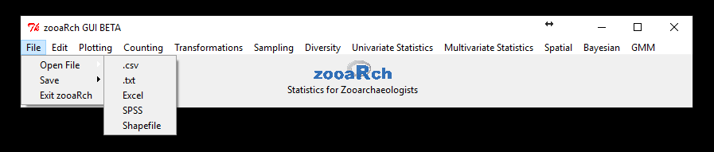
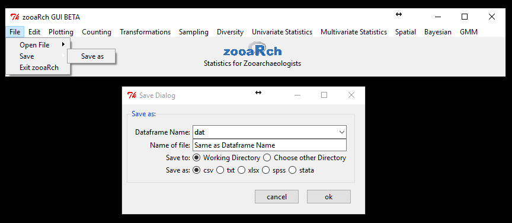
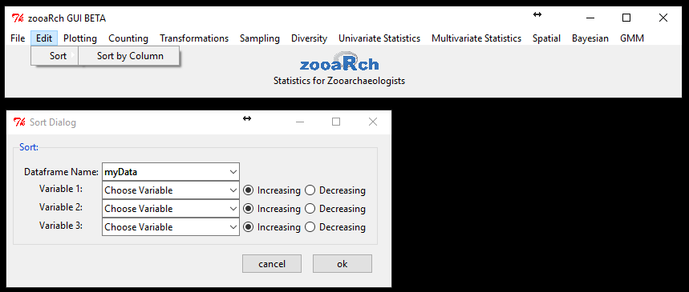
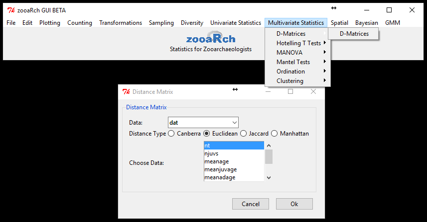

Zooarchaeology is concerned with the analysis and inference of faunal remains recovered from archaeological sites. The **zooaRchGUI package** provides a *Graphical User Interface (GUI)* to analytical tools for zooarchaeological data in the R package. Functions in this package allow users to:

* input 
* handle 
* visualize 
* and analyze zooarchaeological data

Useful data are available with the package. After installing and starting zooaRchGUI, users will have access to these data. Most datasets are in ["wide format"](https://en.wikipedia.org/wiki/Wide_and_narrow_data). Included is Binford's comprehensive forager dataset (Binford 2001) made available by Dr. Amber Johnson from http://ajohnson.sites.truman.edu/data-and-program/. Typing "?LRBdata" into the R (or RStudio) console provides information about the dataset. The key to this dataset is also available and provides users with descriptions of the variable names. The Binford dataset can be used as example for most functions in zooaRchGUI.

<br>

## Part 1 **Installing zooaRchGUI**

#### Install R and RStudio
1.	Install R by downloading the latest version from the Cromprehensive R Archive Network (CRAN) https://www.r-project.org/. 
2.	To make coding easier, you might also want to download RStudio from https://www.rstudio.com/products/RStudio/#Desktop.

#### Install the *zooaRchGUI* package
1.	Prior to installing the zooaRchGUI package, please make sure you have the following programs installed in your Apple/Windows/Linux machines:
    a.	Apple Macintosh machines NEED to have XQuartz installed, download from	https://www.xquartz.org/ 
    b.  Please download and install "JAGS", necessary for Bayesian computations, for your particular operating system from the download section in http://mcmc-jags.sourceforge.net/
2.	Now that you have these installed, start up R or RStudio.
3.  There are several ways to install the latest version of zooaRchGUI:
    
    a. Directly from CRAN: 
    ```{r, eval=FALSE,echo=TRUE} 
    install.packages("zooaRchGUI", dependencies=TRUE)
    ``` 
    b. or from github (installing devtools), where versions with latest patches can be found:
    ```{r, eval=FALSE,echo=TRUE} 
    install.packages("devtools")
    library(devtools)
    install_github("zooarchGUI/zooaRchGUI", dependencies=TRUE)
    ``` 
4.	You can install the following necessary packages by copying and pasting the following R code into the RStudio console
    ```{r, eval=FALSE,echo=TRUE}
    install.packages(c("ggplot2","tcltk2", "tkrplot", "car", "readxl","foreign",
                   "maptools","spdep","raster", "tripack", "pgirmess", "geomorph", 
                   "vegan", "splancs", "rjags", dependencies = TRUE))
    ```
5.	You can also install these packages interactively by typing the names of the packages into RStudio. Get this R-studio dropdown through tools->Install Packages. Make sure "installed dependencies" is checked


6.	Once the package is installed [DONE (zooaRchGUI)], you can load zooaRchGUI by sending the following commands to the R-studio console:
```{r, eval=F,echo=T}

library(zooaRchGUI)
```

Start up *zooaRchGUI* by typing
```{r, eval=F,echo=T}
zooaRch_GUI()
```
into the RStudio console. Then, the GUI should appear  


 
That's it! You can browse through the package, import your own data, or use the included datasets in the package. Type the command: help(package = "zooaRchGUI") into the console):
<br><br>


## Part 2 **Using zooaRchGUI**

### **0. Help Menu**
#### 0.1 About
  The **zooaRchGUI package** provides a *Graphical User Interface (GUI)* to analytical tools for zooarchaeological data in the R computing environment.
<br><br>

#### 0.2 zooaRchGUI User Guide

  This will open the user guide to the zooaRchGUI program.
<br><br>

#### 0.3 Example Data
<br>

#### Spatial

##### Spatial Polygon

  This dataset is useful for functions in the spatial menu, particularly with the Ripley's K function. It contains an example of a spatial polygon. It can also be loaded using data(spatPOLY).
  <br>

##### Random Spatial Points

  This dataset contains an example of completely random points. It is a dataframe that is useful for functions in the spatial menu. It can also be loaded using data(randPTS). These data are particularly useful with the Ripley's K function.
  <br>

##### Clustered Spatial Points

  This dataset contains an example of random points in clusters. It is a dataframe that is useful for functions in the spatial menu. It can also be loaded using data(clusterPTS).
  <br><br>
  
#### Multivariate

##### Binford's Data

  This dataset is the forager database from Binford 2001. It can be used with most functions in the program. It can be loaded using data(LRBdata).
  <br>

##### Binford's Variable Key

  This is a dataframe containing information on all of the variables used in the Binford 2001 dataset. It can be loaded using data(LRBkey).
  <br>

##### Site-x-Species

  This is an example dataframe. It can be used in most functions in the program. It can be loaded using data(myData).
  <br><br>

#### Chi Squared

##### Clarkson Deer Data

  This is a dataframe containing the anatomical part location at the Clarkson site (Otarola-Castillo 2010 JAS). It is useful in the Chi Squared function. It can be loaded using data(ClarksonLimbLoc).
  <br><br>
  
#### Survivorship

##### Garnsey Survival

  This is a dataframe containing bison survival data from Speth 1983. It is useful in the survivorship function. It can be loaded using data(speth83).

##### Marj Rabba Survival

  This is a dataframe containing survival data from the Marj Rabba site. It is useful in the survivorship function. It can be loaded using data(marjRab).
  
##### Marj Rabba Fusion

  This is a dataframe containing fusion data from the Marj Rabba site. It is useful in the survivorship function. It can be loaded using data(marjRab.fuse).
  
##### Winslow Fusion

  This is a dataframe containing fusion data from the Winslow site. It is useful in the survivorship function. It can be loaded using data(winslow.fuse).
<br><br><br>

### **1. File Menu**  

  

#### 1.1 Open File 
   
##### .csv


  This function will open a window that searches the computer directory for .csv files. These files will be saved under the file name as a dataframe.

##### .txt


  This function will open a window that searches the computer directory for .txt files. These files will be saved under the file name as a dataframe.

##### Excel


  This function will open a window that will search a computer directory for Excel files. These files will be saved under the file name as a dataframe.

##### SPSS


  This function will open a window that will search a computer directory for SPSS files. These files will be saved under the file name as a dataframe.

##### Shapefile 


  This function will open a window that will search a computer directory for Shapefiles. These files will be saved under the file name as a dataframe.
<br><br>
  
#### 1.2 Save

##### Save As  

<br>

  This function will save dataframes in memory as a file type specified by the user. A dataframe can be saved as a .csv, .txt, .spss, or .stata. The file name can either remain the same name as the original dataframe or a name given by the user. The file can be saved in either the working directory or a directory given by the user. 
<br><br>
  
#### 1.3 Exit

  This function will close the zooaRchGUI program.
<br><br><br>  

### **2. Edit Menu**

#### 2.1 Sort

##### Sort by Column  

<br>

  This function will accept a dataframe as the input value. The user can then choose which variables to sort in the dataframe with a maximum number of three variables. The data in the variables can be sorted by increasing or decreasing order. The modified dataframe will be saved in R memory under original filename.
<br><br><br>  

### **3. Plotting Menu**
#### 3.1 Histogram
  
<br>

  This function will create a histogram of the inputted data. It will accept dataframes either already in R memory or loaded by the user. The data used to create a histogram will be selected and saved as a variable. The Y-Axis can be chosen to represent either the frequency or the density of the data represented by the variable. The histogram will be saved in R memory as the variable "Results".
<br><br>  

#### 3.2 Multiway Histogram  

<br>

  This function will create a multi-way histogram. It will accept dataframes either already in R memory or loaded by the user. The data used to create the multi-way histogram will be selected and saved as the plot variable. The histogram will be changed by the factor selected from the dataframe in the by factor combobox. The Y-Axis can be chosen to represent either the frequency or the density of the data represented by the variable. 
<br><br>
  
#### 3.3 Bivariate  

<br>

  This function will create a bivariate plot. It will accept dataframes either already in R memory or loaded by the user. The first variable in the plot will be selected in the X-variable combobox. The second variable in the plot will be selected in the Y-variable combobox. The plot will have an equal aspect ratio if the checkbox is marked.
<br><br>
  
#### 3.4 Boxplot  

<br>

  This function will create a boxplot. It will accept dataframes either already in R memory or loaded by the user. The data used to create the boxplot will be selected and saved as a variable. The data will be plotted if the checkbox is marked. The boxplot will be saved in R memory as the variable "Results".
<br><br>
  
#### 3.5 Multiway Boxplot  

<br>

  This function will create a multi-way boxplot. It will accept dataframes either already in R memory or loaded by the user. The variable to be plotted will be represented by the plot variable. The factor that the boxplot will be modified by is represented by the data in the factor combobox. The data will be plotted if the "plot data" checkbox is marked. The notch will be plotted if the "Notch" checkbox is marked. The width of the boxplot will be proportional to the square-roots of the number of observations in the group if the "N width checkbox is marked. The boxplot will be horizontal if the checkbox "Horizontal" is marked, otherwise the boxplot will be vertical.
<br><br><br>  

### **4. Counting Menu**
#### 4.1 Tabulation

##### MNI
    
  This function is currently unavailable. 

##### MNE

  This function is currently unavailable.

##### MAU

  This function is currently unavailable.

##### %MAU

  This function is currently unavailable.
<br><br>
  
#### 4.2 LP-Index

##### LP

  This function is currently unavailable.

##### LP2

  This function is currently unavailable.
<br><br>
  
#### 4.3 ABCML

##### ABCML

  This function is currently unavailable.
<br><br>
  
#### 4.4 Sexing

##### Regression

  This function is currently unavailable.

##### DFA

  This function is currently unavailable.

##### Kernal Density

  This function is currently unavailable.

##### Mixing-Model

  This function is currently unavailable.
<br><br><br>  

### **5. Transformations Menu**
#### 5.1 Mathematical  

<br>

  This function will create a mathematical transformation of the inputted data. It will accept dataframes either already in R memory or loaded by the user. The data will be modified using log, log10, sqrt, arcsin, prop, or Zscore depending on which of these options are selected. Results will be saved in R memory under the filename "Results". If the "append" checkbox is marked the output will be added onto any existing "Results" files in R memory.
<br><br>
  
#### 5.2 Zooarchaeological

##### LSI


  This function will standardize the size of the dataframe. It will accept dataframes either already in R memory or loaded by the user. The column that the dataframe will be standardized to is selected in the "Select Standard" combobox. The resulting data is saved as "standards" in R memory.

##### VSI
  

<br>

  This function will standardize the size of the dataframe. It will accept dataframes either already in R memory or loaded by the user. The column that the dataframe will be standardized to is selected in the "Select Standard" combobox. The resulting data is saved as "standards" in R memory.
<br><br><br>  

### **6. Sampling Menu**
#### 6.1 Single Sample Rarefaction


<br>

  This function will perform a rarefaction analysis of a single sample. It will accept dataframes either already in R memory or loaded by the user. The variable that the analysis will be done on is chosen along with the margins in which the index is computed and the conf.levels. The results can be plotted if the "plot" checkbox is marked. The results of the analysis are saved in R memory as "Results".
<br><br>
  
#### 6.2 Multiple Sample Rarefaction*


<br>

  This function will perform a rarefaction analysis for multiple samples. It will accept dataframes either already in R memory or loaded by the user. The variable that the analysis will be done on is chosen along with the margins in which the index is computed and the conf.levels. The results can be plotted if the "plot" checkbox is marked. The results of the analysis are saved in R memory as "Results".
<br><br><br>  

### **7. Diversity Menu**
#### 7.1 Diversity

##### Indices


<br>

  This function will create the indices of a dataset. It will accept dataframes either already in R memory or loaded by the user. The indices that can be chosen are: shannon, simpson, isimpson, margalef, menhinick. The results can be appended to the original dataset if the "append" checkbox is marked, or saved in R memory as "Results".
    <br><br><br>  

### **8. Univariate Statistics Menu**
#### 8.1 Summary Statistics

##### Summary Dialog

<br>

  This function will create a summary of the variable selected. It will accept dataframes either already in R memory or loaded by the user. The summary can be compact, or detailed. The outputs include the variance, standard deviation, interquartile range, mean, median, skewness and percentiles of data. The results are printed in the console and saved in R memory as "Results".

<br><br>
  
#### 8.2 Normality Test

##### Shapiro-Wilk's Test


<br>

  This function will perform a Shapiro-Wilk's test on the selected dataset. It will accept dataframes either already in R memory or loaded by the user. The variable from the dataset that the test will be performed on is chosen in the "Variable" combobox. The results will be plotted if the "qqplot" checkbox is marked. The results will be saved in R memory as "Results".

##### Kolmogorov-Smironov Test


<br>

  This function will perform a Kolmogorov-Smirov test on the selected dataset.  It will accept dataframes either already in R memory or loaded by the user. The variable from the dataset that the test will be performed on is chosen in the "Variable" combobox. An edcf plot will be created if the "edcf plot" checkbox is marked. The results will be saved in R memory as "Results".
<br><br>
  
#### 8.3 Means

##### One Sample T-Test


<br>

  This function will perform a t-test on one sample. It will accept dataframes either already in R memory or loaded by the user. The variable from the dataset is chosen in the "Variable" combobox. The Mu value is inputted by the user along with the conf.level. The Alternative can be chosen to be either two-sided, less than, or greater than. The result are printed into the console and saved in R memory as "Results".

##### Two Sample T-Test


<br>

  This function will perform a t-test on two samples. It will accept dataframes either already in R memory or loaded by the user. The two variables for the test are chosen in their respective comboboxes. The conf.level is decided with the slider. The alternative can either be two-sided, less than, or greater than. The variables can be equal and/or paired if the checkboxes "var.equal" and "paired" respectively are marked. The results are printed into the consoles and saved in R memory as "Results".

##### One-Way ANOVA


<br>

  This function will perform a one-way ANOVA test on the selected dataset. It will accept dataframes either already in R memory or loaded by the user. The response variable is chosen using the "Response" combobox. The predictor variable is selected using the "Variable 1" combobox. The results can be plotted if the "plot" checkbox is marked. The results of the test are saved in R memory as "Results". The results and summary are also printed into the console.

##### Factorial ANOVA


<br>

  This function will perform a factorial ANOVA test on the selected dataset. It will accept dataframes either already in R memory or loaded by the user. The response variable is chosen using the "Response" combobox. The first and second variables are selected using the "Variable 1" and "Variable 2" respectively. The interaction between the two variables can be either multiplication or addition depending on the input in the "interaction" combobox. The results will be saved in R memory as "Results". The results and summary are printed to the console. The result can be plotted if the "plot" checkbox is marked.
<br><br>
  
#### 8.4 Proportions

##### Chi Squared (row-by-column tests)


<br>

  This function will perform the Chi Squared row-by-column test on the selected dataset. It will accept dataframes either already in R memory or loaded by the user. The first and second variable for the test *must be categorical* and can be selected in the "Variable 1" and "Variable 2" comboboxes respectively. The Monte Carlo value is selected using the slider, if a permutation test is desired. A Yate's Correction will be performed during the test if the "Yate's Correction" is marked. The results are saved to the R memory as "Results". The results are also printed in the console. Use *data("ClarksonLimbLoc")* for an example, or choose appropriate categorical vaiables from *data(LRBdata)*.

##### Fisher's Exact Test


<br>

  This function will perform the Fisher's Exact test on the selected dataset. It will accept dataframes either already in R memory or loaded by the user. The first and second variable for the test *must be categorical* and can be selected in the "Variable 1" and "Variable 2" comboboxes respectively. The conf.level is chosen using the conf.level slider. The alternative can either be two sided, less than, or greater than. The Monte Carlo value is selected using the Monte Carlo slider. The results of the test will be printed out in the console and plotted. The results will be saved in R memory as "Results". Use *data("ClarksonLimbLoc")* for an example, or choose appropriate categorical vaiables from *data(LRBdata)*.
<br><br>
  
#### 8.5 Variances

##### F-Test


<br>

  This function will perform a F Variance test on the selected dataset. The Monte Carlo value is selected using the slider. It will accept dataframes either already in R memory or loaded by the user. The first and second variable for the test will be selected in the "Variable 1" and "Variable 2" comboboxes respectively. The conf.level is chosen using the conf.level slider. The alternative can be either two sided, less than, or greater than. The results can be plotted if the "plot" checkbox is marked. The results are printed in the console and saved in R memory as "Results". 

##### Bartlett's Test


<br>

  This function will perform a Bartlett's Variance test on the selected dataset. It will accept dataframes either already in R memory or loaded by the user. The first and second variables for the test will be selected in the "Variable 1" and "Variable 2" comboboxes respectively. The results can be plotted if the "plot" checkbox is marked. The results are printed onto the console and saved in R memory as "Results".

##### Levene's


<br>

  This function will perform a Levene's Variance test on the selected dataset. It will accept dataframes either already in R memory or loaded by the user. The first and second variables for the test will be selected in the "Variable 1" and "Variable 2" comboboxes respectively. The center can either be the median of the data or the mean of the data. The results can be plotted if the "plot" checkbox is marked. The results are printed in the console and saved in R memory as "Results".
<br><br>
  
#### 8.6 Association

##### Correlation


<br>

  This function will perform an Association test on the selected dataset. It will accept dataframes either already in R memory or loaded by the user. The first and second variables for the test will be selected in the "Variable 1" and "Variable 2" comboboxes respectively. The conf.level will be selected using the conf.level slider. The alternative can either be tow sided, less than, or greater than. The Pearson's r, Kendall's tau, Spearman's rho, and the Covariance can be calculated if their respective checkboxes are marked. If calculated they will be saved in R memory as "Pearson_Results", "Kendall_Results", "Spearman_Results", and "Covariance_Results" respectively. The results can be plotted if the "plot" checkbox is marked. 

##### Simple Linear Regression


<br>

  This function will perform a simple linear regression on the selected dataset. It will accept dataframes either already in R memory or loaded by the user. The response variable and the predictor variable are chosen using the "Response" and "Predictor" comboboxes respectively. The results can be plotted if the "plot" checkbox is marked. The results are printed in the console. 

##### Generalized Linear Model


<br>

  This function will create a generalized linear model of the selected dataset. It will accept dataframes either already in R memory or loaded by the user. The response variable is selected using the "Response" dropdown menu. The first and second variable are selected using the "Variable 1" and "Variable 2" dropdowns respectively. The interaction between the variables can either be multiplication or addition depending on the selection in the interaction chosen in the "interaction" combobox. The distribution is determined by the "Distribution" combobox. The distribution can be either gaussian, binomial, poisson, or gamma. The variables can be linked either by identity, logit, log, or inverse. The results can be plotted if the "plot" checkbox is marked. The results are printed in the console and saved in R memory as "Results".
<br><br>
  
#### 8.7 Survivorship

##### Survivorship


<br>

  This function is will determine the survivorship of the dataset. It will accept dataframes either already in R memory or loaded by the user. The labels can be chosen using the "Labels" combobox to determine the dataset that the labels come from. The dataset that the model will come from is chosen using the "Model" combobox. The conf.level is selected using the conf.level slider. The functions that can be used are either the survivorship, Mortality, or Epophyseal Fusion functions. The number of iterations that the functions are run is determined by the "Iterations" spinbox. The results are printed in the console and saved in R memory as "Results".
<br><br><br>  

### **9. Multivariate Statistics Menu**
  
#### 9.1 D-Matrices

##### D-Matrices


<br>

  This function will calculate the distance function of the selected data. It will accept dataframes already in R memory or loaded by the user. The methods that the distance can be calculated are: Canberra, Euclidean, Jaccard, and Manhattan. The variables that the distance between will calculated are selected by the user. The output will be saved as a distance matrix as "D_Matrix_Results".
<br><br>
  
#### 9.2 Hotelling T-Tests

##### One Sample

  This function is currently unavailable.

##### Two Sample*


<br><br>
  
#### 9.3 MANOVA

##### MANOVA


<br>

  This function will perform a MANOVA on the selected dataset. It will accept dataframes already in R memory or loaded by the user. The response and predictor variables are chosen using the "Response" and "Predictor" comboboxes respectively. The interactions between the two variables can either be additive or multiplicative. The test that will be conducted can be the Wilks, Pillai, Hotelling-Lawley, Roy. The results are printed in the console and saved in R memory as "Results".

##### NP-MANOVA


<br>

  This function will perform a NP-MANOVA on the selected dataset. It will accept dataframes already in R memory or loaded by the user. The response and predictor variables are chosen using the "Response" and "Predictor" comboboxes respectively. The interactions between the two variables can either be additive or multiplicative. The methods that will be used to find the distance can be the Canberra, Euclidean, Jaccard, or Manhattan. The number of permutations that is selected using the "Permutations" slider. The results are printed in the console and saved in R memory as "Results".
<br><br>
  
#### 9.4 Mantel Tests

##### 2-way Mantel*


  This function will perform a 2-way Mantel test on the selected datasets. It will accept dataframes already in R memory or loaded by the user. The selected dataframes cannot contain missing values or characters. This function requires two dataframes that will be selected using their respective comboboxes. The columns that the test will be conducted on are selected using the listboxes that correspond to each of the dataframes. Multiple columns can be selected from each listbox. The distance method for each of the datasets can be either Canberra, Euclidean, Jaccard, or Manhattan. The number of permutations for the test is selected using the "Permutations" slider. The results will be printed in the console and saved in R memory as "Results".

##### 3-way Mantel


<br>

  This function will perform a 3-way Mantel test on the selected datasets. It will accept dataframes already in R memory or loaded by the user. The selected dataframes cannot contain missing values or characters. This function requires three dataframes that will be selected using their respective comboboxes. The columns that the test will be conducted on are selected using the listboxes that correspond to each of the dataframes. Multiple columns can be selected from each listbox. The distance method for each of the datasets can be either Canberra, Euclidean, Jaccard, or Manhattan. The number of permutations for the test is selected using the "Permutations" slider. The results will be printed in the console and saved in R memory as "Results".
<br><br>
  
#### 9.5 Ordinations

##### Seriation

  This function is currently unavailable.

##### PCA


<br>

  This function will perform a PCA test on the selected dataset. It will accept dataframes already in R memory or loaded by the user. The selected dataframe cannot contain missing values or characters. The columns that the test will be performed on are selected using the "Choose Data" listbox. Multiple columns can be selected from the dataset. The results can be plotted if the "plot data" checkbox is marked. The results will be printed in the console and saved in R memory as "Results".

##### PCoA


<br>

  This function will perform a principle coordinate analysis on the selected dataset. It will accept dataframes already in R memory or loaded by the user. The selected dataframe cannot contain missing values or characters. The distance method that will be used for the analysis can be either Canberra, Euclidean, Jaccard, or Manhattan. The columns that will be used are selected using the "Choose Data" listbox. Multiple columns can be selected from the dataset. The results of the analysis are plotted and printed in the console. They are also saved in R memory as "PCoA_Results".

##### NMDS


<br>

  This function will perform a non-metric multidimensional scaling analysis on the selected dataset. It will accept dataframes already in R memory or loaded by the user. The selected dataset cannot contain missing values or characters. The number of dimensions that the analysis will be conducted in is selected using the "Dimensions" combobox. The method that the distance will be calculated in can be either Canberra, Euclidean, Jaccard, or Manhattan. The columns that the analysis will be conducted on are chosen using the "Choose Data" listbox. Multiple columns can be chosen from the dataset. A NMDS plot will be created if the "NMDS plot" checkbox is marked. The plot will contain labels if the "Labels" checkbox is marked. A Shepard plot will be created if the "Shepard plot" checkbox is marked. 

##### CA


<br>

  This function will perform a correspondence analysis on the selected dataset. It will accept dataframes already in R memory or loaded by the user. The selected dataset must not contain missing values or characters. The columns that will be used in the analysis are selected using the "Choose Data" listbox. The results can be plotted if the "plot data" checkbox is marked. The results of the analysis are printed in the console and saved in R memory as "Results".

##### Vector Fitting


<br>

  This function will perform a multivariate association analysis using *vector fitting*. It will accept matrices already in the R memory or loaded by the user. The selected dataset must *be the results of an ordination (PCA, CA, PCoA, NMDS)*. The ordination matrix is chosen using the "Ordination" listbox. The variables to be regressed against the ordination should be contained within a matrix object. The matrix of variables will be selected using the "Variables" listbox. The number of axes that the analysis will use with is chosen using the "N Axes" listbox. The number of permutations is chosen using the "Permutations" slider. The results of the analysis will be plotted and printed in the console. They will be saved in R memory as "Vectorfit_Results".
<br><br>
  
#### 9.6 Clustering

##### Hierarchical


<br>

  This function will perform various hierarchical clustering methods on the selected dataset. It will accept distance matrices from the R memory or loaded by the user. The clustering method can be either Single linkage, Complete linkage, Average linkage, Centroid linkage, Mcquitty, Median linkage, Ward's method, or Ward's 2. The results are plotted.

##### K-means
###### **Single K-means**
    

<br>

  This function will perform K-means clustering using simplified parameters. It will accept distance matrices from the R memory or loaded by the user. The selected dataset cannot contain missing values or characters. The columns that will be used are selected using the "Variables" listbox. Multiple columns can be chosen from the dataset. The number of clusters can be chosen using the "Number of Clusters" spinbox. The results can be plotted if the "Plot" checkbox is marked. The results saved in R memory as "SingleKmeans".
<br><br>  

###### **Multiple K-means**
    

<br>

  This function will perform K-means clustering using user-inputted parameters. It will accept distance matrices from the R memory or loaded by the user. The dataset cannot contain missing values or characters. The columns that will be used are selected using the "Variables" listbox. Multiple columns can be chosen from the dataset. The minimum and maximum number of clusters can be chosen by the "Min Clusters" and "Max Clusters" spinboxes respectively. The Max number of iterations and the number of random sets that can be chosen are selected by the "Max Iterations" and "nstart" spinboxes respectively. The function will be run verbose if the "Verbose" checkbox is marked. A Scree plot will be created if the "Scree Plot" checkbox is marked. The results will be saved in R memory as "MultiKmeans".
<br><br><br>  

### **10. Spatial Statistics Menu**
#### 10.1 Point Patterns

##### Ripley's K


<br>

  This function will perform a Ripley's K analysis on the selected dataset. It will accept dataframes already in R memory or loaded by the user. It will also accept shapefiles loaded by the user. The shape of the boundary box of the Ripley's K function can be loaded as a shapefile by selecting the "Load" option. The loaded shapefile cannot contain more than one polygon. The boundary shape can also be a custom draw figure if the "Custom" option is selected. With the custom shape a figure will appear on the console. The user will select the vertices of the shape that they wish to create. When the shape is complete the user will click finish to create the shape. The number of bins that the Ripley's K function will use is selected using the "Bins" slider. The number of permutations used is determined by the "Permutations" slider. The results of the function will be plotted and printed in the console.
<br><br>
  
#### 10.2 Spatial Connections

##### Spatially Defined Connections


<br>

  This function will find spatially defined connections in the selected dataset. It will accept spatial polygon dataframes from the R memory or loaded by the user. It will also accept shapefiles loaded by the user. The spatially defined connections can be found using the Queen, Rook, Delauney, Gabriel, or Relative methods. The voroni data can be plotted if the "Voroni data" checkbox is marked. The results of the function are plotted.
<br><br>
  
#### 10.3 Autocorrelation Tests

##### Global Moran's I/Geary C


<br>

  This function will perform a Global Moran's I or Geary C test. It will accept spatial polygon dataframes from the R memory or loaded by the user. It will also accept shapefiles loaded by the user. The input variable is a list in the loaded file that the test will be conducted with. The display title will be the title of the created plot. The method that the test will use is either Moran's I or Geary C. The number of bins is determined by the "Number of Bins" slider. The results of the test are plotted.

##### LISA

  This function is currently unavailable.

##### Getis ORD GI*

  This function is currently unavailable.
<br><br>
  
#### 10.4 Variogram Modeling

##### Plot Spatial Covariance

  This function is currently unavailable.

##### Plot Spatial Semi-Variogram

  This function is currently unavailable.

##### Fit Semi-Variogram

  This function is currently unavailable.
<br><br>
  
#### 10.5 Interpolation

##### Kriging

  This function is currently unavailable.

##### TPS
    
  This function is currently unavailable.

##### IDW

  This function is currently unavailable.
<br><br><br>  

### **11. Bayesian Statistics Menu**
#### 11.1 Bayesian Tests

##### Bayesian 1 sample t-test


<br>

  This function will perform a Bayesian one sample t-test using the selected data. It will accept dataframes already in R memory or loaded by the user. The column that the test will be performed with is selected using the "Variable" combobox. The Mu value the number in the "Mu" entrybox. The credible interval level is determined by the "cred.mass" slider. The results are printed in the console and saved in R memory as "Results".

##### Bayesian 2 sample t-test


<br>

  This function will perform a Bayesian two sample t-test using the selected data. It will accept dataframes already in R memory or loaded by the user. The two columns that will be performed with is selected using the "Variable 1" and "Variable 2" comboboxes respectively. The credible interval is determined by the "cred.mass" slider.  The test will be performed as a paired test if the "paired" checkbox is marked. The results are printed in the console and saved in R memory as "Results".

##### Bayesian Binomial Test


<br>

  This function will perform a Bayesian Binomial test on the selected data. The number of successes and trials that will be performed based on the values in the "Successes" and "Trials" entryboxes. The composition proportion is the value in the "Comp prop" entrybox. The credible interval is determined by the "cred.mass" slider. The results of the test are printed in the console and saved in R memory as "Results".
<br><br><br>  

### **12. Geometric Morphometrics Menu**
#### 12.1 Import Data


<br>

  This function will import .tps .nts, or multiple .nts files. The imported data will be saved as an array with the name of the original file in R memory unless the multi.nts option is chosen. Then the data will be saved in R memory as "collective.array".
<br><br>
  
#### 12.2 Digitize

##### 2D-Digitize

  This function is currently unavailable.

##### 3D-Digitize

  This function is currently unavailable.
<br><br>
  
#### 12.3 GPA


<br>

  This function will perform a gpagen analysis on the selected dataset. It will accept arrays from the R memory or loaded by the user. The curve and the surface arrays are selected from the R memory or loaded by the user. If "None" is selected, then there will be nothing inputted for those values. The type of test that is used is either the Prod, or Bending Energy. The progress is plotted if the "Plot Progress" checkbox is marked. The results of the test are printed in the console, plotted and saved in R memory as "gparesults".
<br><br>
  
#### 12.4 Plot

##### Tangent Space

  This function is currently unavailable.

##### Deformation

  This function is currently unavailable.

##### Reference-Target Deformation

  This function is currently unavailable.

##### Analysis

  This function is currently unavailable.
<br><br><br>
